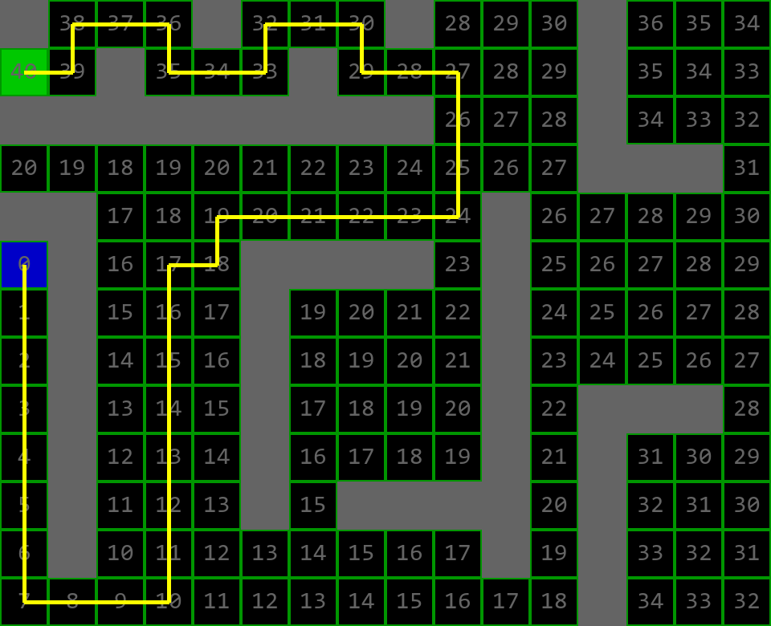

# Path Finding algorithm
This is a solution using Dijkstra’s shortest path algorithm, Greedy Best First Search and A* algorithm.

You can create obstacles on the table and find the shortest path between two points.

## Controls
Mouse Left Click to interact with the table.

'0' to select the blank tile.

'1' to select the obstacle tile.

'2'  to select the starting point.

'3'  to select the end point.

'F1' to use the Dijkstra’s shortest path algorithm.

'F2' to use the Greedy Best First Search.

'F3' to use the A* algorithm.

's' to take a single step in the path finding.

'r' to reset the table.

'm' to show the data of the steps taken to the tiles.

'f' to save an image of the table.

SPACE to run the path finding.

Button 'X' of the window to close.

## How to run
To run, install all the dependencies from `requirements.txt`. You can use the following steps.

```py
pip install -r requirements.txt
py scr
```

## Solution Example

